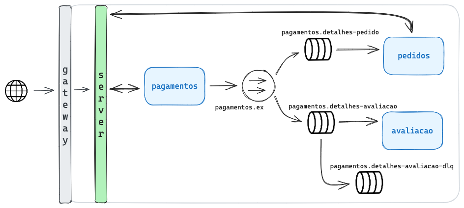

# alura-food

Projeto desenvolvido em Spring com objetivo de praticar comunicação assíncrona usando RabbitMQ.

## Arquitetura




## Endpoint

**POST** `/pagamentos-ms/pagamentos` Cadastra pagamento
```bash
curl --request POST \
  --url http://localhost:8082/pagamentos-ms/pagamentos \
  --header 'Content-Type: application/json' \
  --header 'User-Agent: insomnia/8.4.2' \
  --data '{
        "valor": 1300.00,
        "nome": "renatão",
        "numero": "0001",
        "expiracao": "10/2028",
        "codigo": 123,
        "status": "CRIADO",
        "formaDePagamentoId": 1,
        "pedidoId": 1
}'
```
```json
{
	"id": 1,
	"valor": 1300.00,
	"nome": "renatão",
	"numero": "0001",
	"expiracao": "10/2028",
	"codigo": "123",
	"status": "CRIADO",
	"pedidoId": 1,
	"formaDePagamentoId": 1
}
```

## Como Usar

- Adicione a imagem e suba o container docker do RabbitMQ
```bash
docker run -it --rm --name rabbitmq -p 5672:5672 -p 15672:15672 rabbitmq:3.10-management
```
- Após pode subir os microsserviços *server*, *gateway*, *pagamentos*, *avaliacao* e *pedido*

- Pode consultar os serviços registrados no Eureka acesse http://localhost:8081/

- Para as filas do RabbitMQ acesse http://localhost:15672/
     - Usuario e Senha é **guest**

## Links
- [RabbitMQ](https://www.rabbitmq.com/)
- [Formação Java e Microsserviços com Spring e RabbitMQ](https://cursos.alura.com.br/formacao-java-microsservicos)   